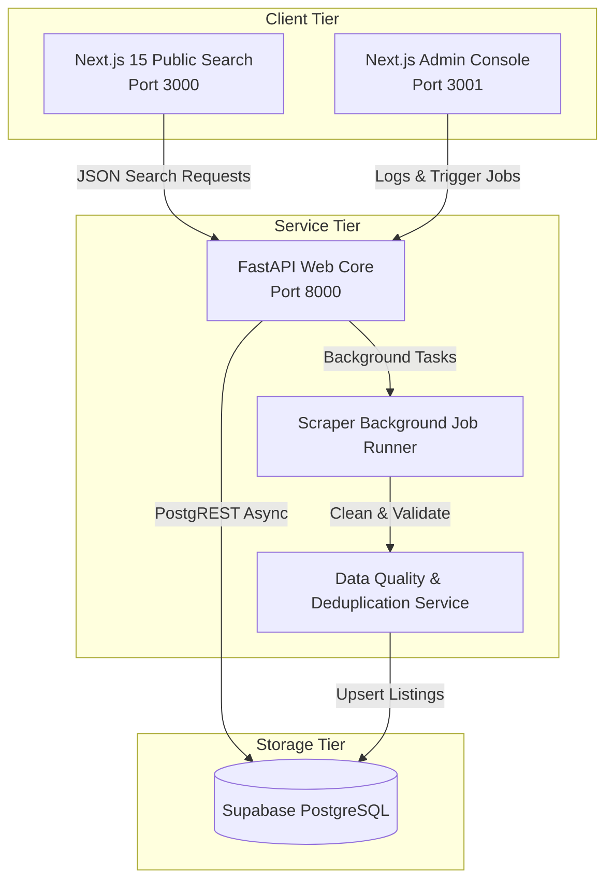
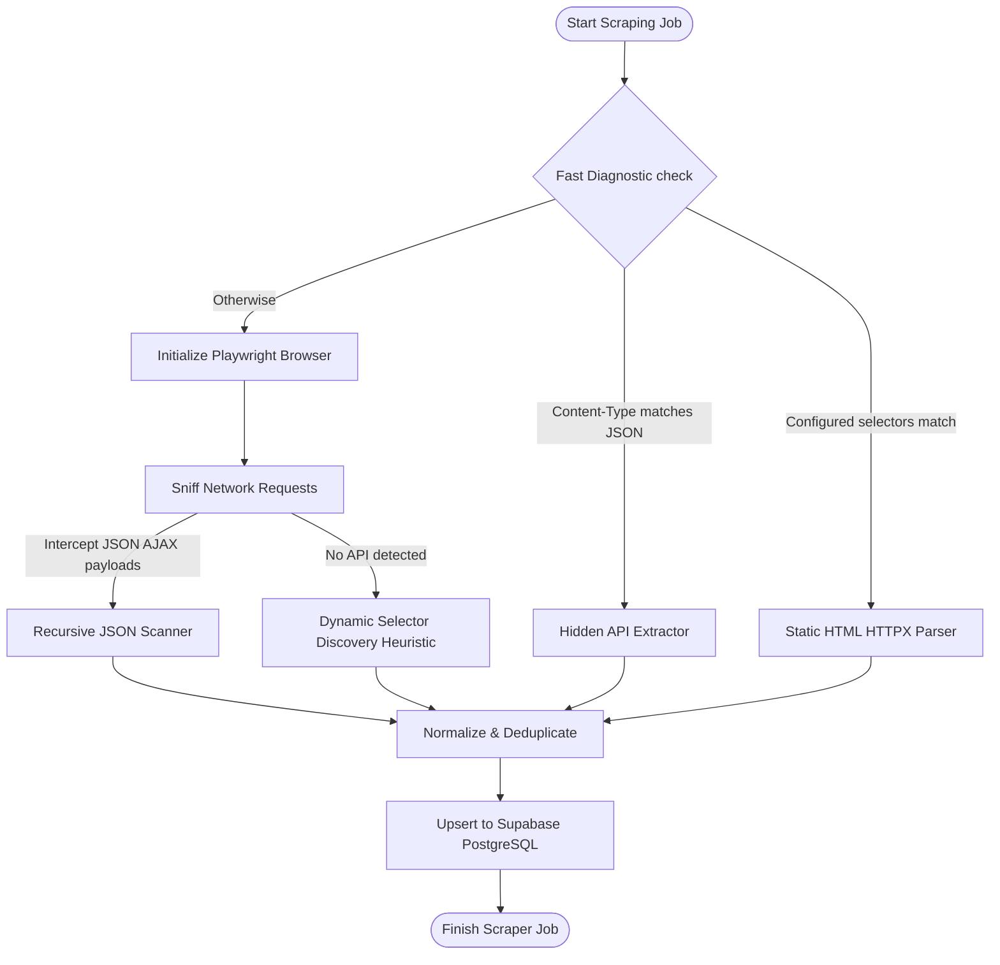

# Dealer Discovery Platform - Architecture & Design Specification

This document provides a detailed overview of the system architecture, subsystem interaction patterns, database layouts, and background scraping strategy heuristics.

---

## 1. Subsystems Topology

The system is split into three main components: a central **FastAPI backend**, an **Admin Console panel**, and a redesigned **Public Search Portal**.

---

## 2. Universal Autonomous Scraper Engine

Our scraping subsystem is built on top of [generic_scraper.py](file:///D:/DisBiz/dealer-discovery-platform/backend/app/scrapers/generic_scraper.py). It operates without brand-specific selector configuration by sequentially evaluating target websites:

### Strategy Heuristics:
1. **Hidden API Sniffing (Priority 1)**: First parses background AJAX (`XHR`, `Fetch`, `REST`) requests matching patterns like `/api/`, `locator`, `stores`, `dealers`. If JSON structure is returned, the engine runs recursive parsing.
2. **Static HTML Extraction (Priority 2)**: Checks for rapid page loading via HTTPX. Looks for structured address tags or custom selectors.
3. **Playwright Fallback Heuristic (Priority 3)**: Launches headless Chromium. Automatically clicks standard cookie banners (looks for "accept", "cookie", "agree" IDs) and handles infinite scroll pages.

---

## 3. Data Quality & Deduplication Layer

To prevent index pollution, all parsed results pass through a strict cleaning pipeline:
- **Phone Cleaning**: Sanitizes prefixes, removes parenthesis/dashes, and checks format length.
- **Email Scrubbing**: Verifies email formatting against standard Regex profiles.
- **Geocoding**: If a dealer record contains a maps link or address without direct latitude/longitude keys, the coordinates parser extracts them directly from the Google Maps links, or calculates them.
- **Jaccard Distance Deduplication**: Checks incoming dealer records against existing records in the database. If names have a Jaccard overlap similarity index $> 0.85$ and are in the same city/state, they are merged.

---

## 4. Database Schema Specifications

Our Supabase PostgreSQL layout utilizes the following tables:

### `brands`
Stores registered manufacturer details:
- `id` (UUID, Primary Key)
- `name` (VARCHAR, Unique)
- `slug` (VARCHAR)
- `official_website` (VARCHAR)
- `dealer_locator_url` (VARCHAR, Unique)
- `category` (VARCHAR)
- `industry` (VARCHAR)

### `dealers`
Contains authorized outlets coordinates and contacts:
- `id` (UUID, Primary Key)
- `brand_id` (UUID, Foreign Key)
- `brand_name` (VARCHAR)
- `dealer_name` (VARCHAR)
- `address` (TEXT)
- `city` (VARCHAR)
- `state` (VARCHAR)
- `pincode` (VARCHAR)
- `latitude` (DOUBLE PRECISION)
- `longitude` (DOUBLE PRECISION)
- `phone` (VARCHAR)
- `email` (VARCHAR)
- `website` (VARCHAR)
- `quality_score` (INTEGER)
- `validation_status` (VARCHAR)

### `scraper_runs`
Logs telemetry execution details:
- `id` (UUID, Primary Key)
- `brand_id` (UUID, Foreign Key)
- `status` (VARCHAR: `RUNNING`, `COMPLETED`, `FAILED`)
- `dealers_found` (INTEGER)
- `error_message` (TEXT)
- `created_at` (TIMESTAMP)

---

## 5. Next.js Public Portal Redesign

The redesigned consumer-facing portal is modularized into reusable React components located under `frontend-public/src/components/`:

- **State Syncing**: State management flows from the central client layout page down to subcomponents, coordinating filter changes, page numbers, sorting methods, and visual loaders.
- **Persistent Favorites**: Stores selected dealerships directly in the browser's `localStorage`, allowing users to build a persistent watchlist.
- **Adaptive Drawer Layouts**: Horizontal filter layouts compress into an animated slide-out Drawer sheet on mobile viewports.
